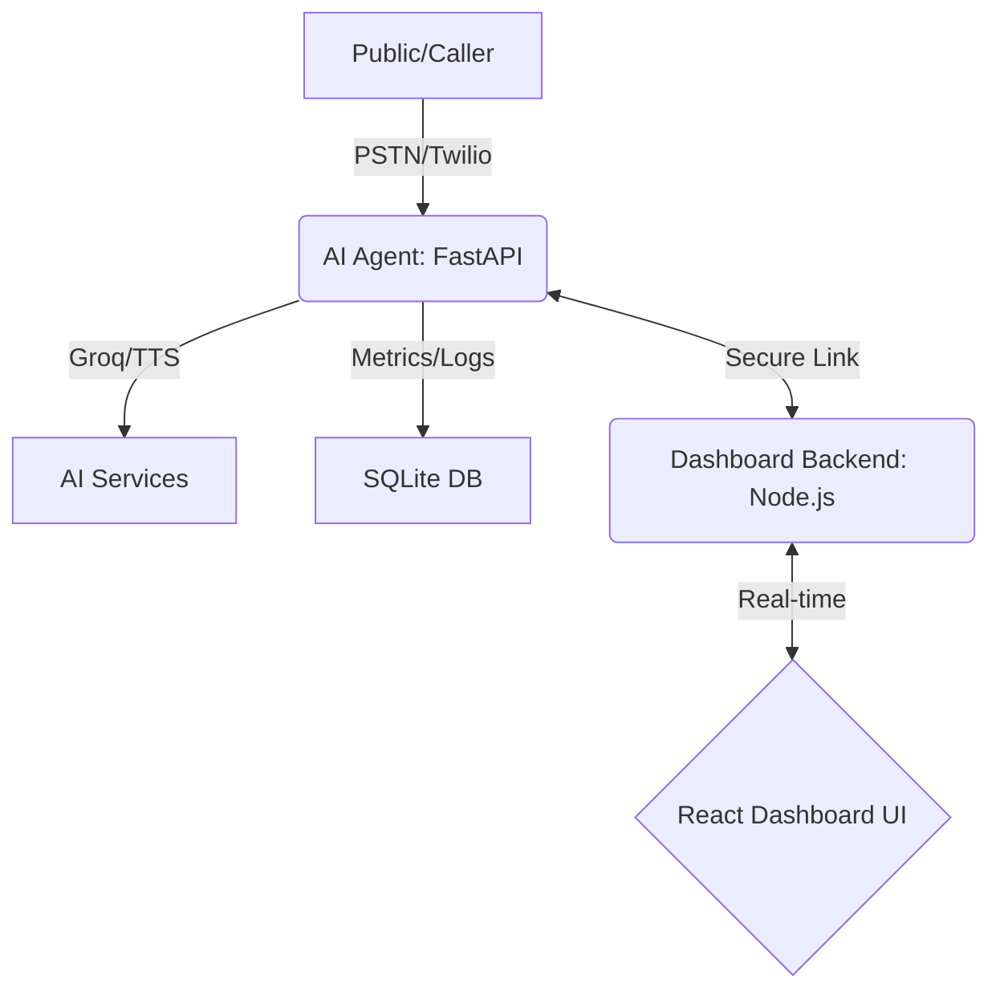

# 🌐 Global Production Guide: National Scale AI Infrastructure

This document provides a birds-eye view of the entire integrated system: the **Amharic AI Engine** and the **MARKOVA Management Dashboard**.

---

## 🏛️ System Architecture

---

## 🚀 Unified Deployment Checklist

### Phase 1: AI Agent (The Engine)
1. Deploy to **Port 8001**.
2. Configure `.env` with `DASHBOARD_API_KEY`.
3. Set up **Twilio Webhook** to point to `/incoming-call`.
👉 [Detailed Agent Guide](file:///d:/amharic-ai-call-demo/DEPLOYMENT_GUIDE.md)

### Phase 2: MARKOVA Dashboard (The Control Room)
1. Deploy Backend to **Port 5000**.
2. Build & Serve Frontend via **Nginx**.
3. Use the same `DASHBOARD_API_KEY` for secure handshake.
👉 [Detailed Dashboard Guide](file:///D:/system%20dashborad/DEPLOYMENT_GUIDE.md)

### Phase 3: Secure Handshake
Once both are running, open the Dashboard and use the **Link External Agent** feature to connect the Agent's URL.

---

## 🛡️ Critical Security Baseline
- **SSL**: All components MUST use HTTPS in production.
- **Firewall**: Only ports **80, 443, and 22** should be open.
- **Keys**: Rotate `ENCRYPTION_KEY` and `DASHBOARD_API_KEY` before going live.
- **Database**: The AI Agent uses SQLite with **WAL mode** enabled for high-concurrency 100+ call support.

---

**Handover Verified**: All metrics (Call Volume, Latency, Success Rate) are 100% real-time and fetched from live agent nodes.
