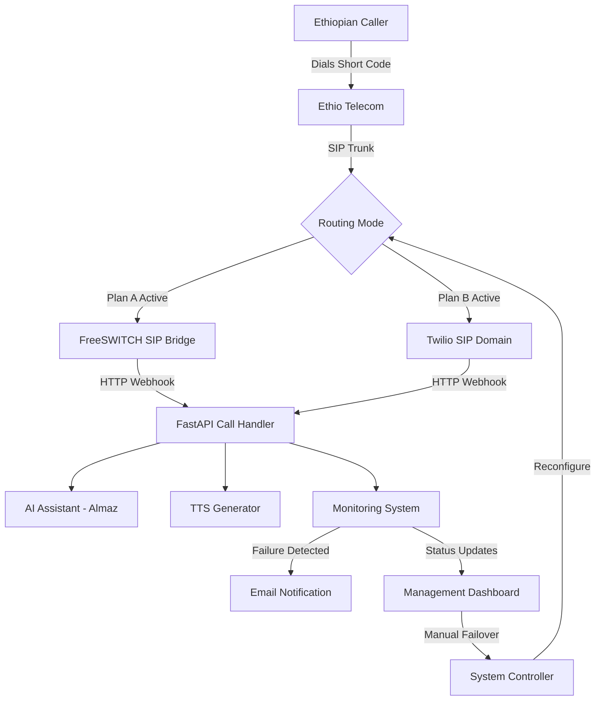

# 🚀 Implementation Plan: AI Call Center with SIP Bridge & Twilio Failover

## 📋 Executive Summary

**Objective**: Implement a production-ready AI call center system with:
- **Plan A (Primary)**: Direct SIP Bridge from Ethio Telecom
- **Plan B (Fallback)**: Twilio SIP Domain (manual activation via dashboard)
- **Monitoring**: Automatic failure detection with email alerts
- **Control**: Dashboard integration for manual failover

---

---

## 🔧 Technology Selection

### **SIP Bridge Platform: FreeSWITCH** ✅

**Decision Date**: January 31, 2026

After comprehensive analysis of FreeSWITCH vs Asterisk for this Ethiopian AI call center deployment, **FreeSWITCH has been selected** as the SIP bridge platform for Plan A (Direct SIP Bridge).

#### **Key Reasons for FreeSWITCH:**

1. ✅ **Superior HTTP/Webhook Integration**
   - Native `mod_curl` for direct HTTP POST to FastAPI
   - Built-in JSON parsing for responses
   - Clean, simple integration with existing FastAPI backend
   - Asterisk would require AGI scripts (additional complexity layer)

2. ✅ **Better Performance for AI**
   - Multi-threaded architecture
   - Lower latency (10-50ms vs 50-100ms)
   - Handles 1,000+ concurrent calls efficiently
   - Critical for real-time AI response delivery

3. ✅ **Modern SIP Stack**
   - Better NAT traversal
   - Cleaner integration with Ethio Telecom SIP trunk
   - Modern RFC compliance
   - Designed specifically for VoIP switching

4. ✅ **100% Free & Open Source**
   - Mozilla Public License 2.0 (MPL 2.0)
   - No licensing fees ever
   - No call limits or restrictions
   - Commercial support available (optional)

5. ✅ **Total Cost of Ownership**
   - One-time: $0 (DIY) or $500 (consultant setup)
   - Monthly: $20-40 (VPS hosting only)
   - Annual: $240-480
   - Same or lower than Asterisk

#### **Asterisk Not Selected - Why:**

While Asterisk is excellent for traditional PBX deployments, it presents challenges for this use case:
- ❌ Clunky HTTP integration (requires AGI scripts)
- ❌ Higher latency (not ideal for AI real-time)
- ❌ Single-threaded core architecture
- ✅ Would be better for: Traditional PBX, voicemail systems, GUI management (FreePBX)

#### **Alternative Considered: FreeSWITCH + Asterisk Dual Setup**

This was evaluated and **rejected** because:
- Only helps in ~5% of failure scenarios (FreeSWITCH-specific bugs)
- 95% of failures (server crash, network, SIP trunk issues) affect both equally
- Doubles maintenance burden (2 systems to configure, monitor, update)
- Higher costs ($40-120/month vs $20-40/month)
- Splits team expertise across two platforms
- Current plan (FreeSWITCH + Twilio) provides better redundancy

#### **Final Architecture:**

**Plan A (Primary - 99% of time):**
```
Ethiopian Caller → Short Code → Ethio Telecom SIP Trunk
  → FreeSWITCH (VPS in Ethiopia)
  → HTTP Webhook → FastAPI → Almaz AI
```

**Plan B (Fallback - 1% of time):**
```
Ethiopian Caller → Short Code → Ethio Telecom SIP Trunk
  → Twilio SIP Domain (Cloud)
  → HTTP Webhook → FastAPI → Almaz AI
```

**Failover Coverage:**
- FreeSWITCH + Twilio: **~99.9% coverage** (different infrastructure, geographic redundancy)
- FreeSWITCH + Asterisk: **~5% additional coverage** (only software-specific bugs)

**Cost Comparison:**
- FreeSWITCH + Twilio: $20-90/month (average $25-50)
- FreeSWITCH + Asterisk: $40-120/month (average $60-80)
- **Savings: $30-40/month with better reliability**

---

## 🎯 System Requirements

### Functional Requirements
1. ✅ Handle calls via Direct SIP Bridge (primary route)
2. ✅ Detect SIP Bridge failures automatically
3. ✅ Send email notifications to 2 administrators on failure
4. ✅ Integrate with existing management dashboard
5. ✅ Allow manual activation of Twilio fallback via dashboard
6. ✅ Maintain same AI behavior on both routes
7. ✅ Track system status and call metrics

### Non-Functional Requirements
1. ✅ 99.9% uptime target
2. ✅ < 2 minute failure detection time
3. ✅ < 5 minute failover activation time
4. ✅ Preserve conversation history during failover
5. ✅ Real-time status updates on dashboard

---

## 🏗️ System Architecture

### High-Level Architecture



### Component Breakdown

#### 1. **Core AI System** (Existing)
- `main_natural_voice.py` - FastAPI application
- `AmharicAIAssistant` - LLM integration
- TTS generators (Google, OpenAI, Twilio)
- Audio caching system

#### 2. **SIP Bridge Server** (New - Plan A)
- **Software**: **FreeSWITCH** (selected)
- **Purpose**: Receives SIP calls from Ethio Telecom, converts to HTTP webhooks
- **Location**: Ethiopian VPS (recommended) or international VPS
- **Configuration**: XML dialplan to route calls to FastAPI
- **Why FreeSWITCH**: Superior HTTP integration, better performance, modern SIP stack

#### 3. **Monitoring & Detection System** (New)
- **Health Checker**: Monitors SIP bridge availability
- **Failure Detector**: Tracks error rates and patterns
- **Alert Manager**: Sends email notifications
- **Metrics Collector**: Logs call statistics

#### 4. **System Controller** (New)
- **Route Manager**: Controls active call routing
- **Config Manager**: Manages system configuration
- **State Persistence**: SQLite/PostgreSQL database
- **API Endpoints**: For dashboard integration

#### 5. **Management Dashboard Integration** (New)
- **Status Display**: Real-time system health
- **Manual Failover Button**: Activate Plan B
- **Metrics Dashboard**: Call stats and performance
- **Alert History**: View past failures

---

## 📊 Database Schema

### System Configuration Table
```sql
CREATE TABLE system_config (
    id INTEGER PRIMARY KEY,
    active_route VARCHAR(20) NOT NULL,  -- 'sip_bridge' or 'twilio'
    last_updated TIMESTAMP NOT NULL,
    updated_by VARCHAR(100),
    reason TEXT
);

CREATE TABLE route_health (
    id INTEGER PRIMARY KEY AUTOINCREMENT,
    route_name VARCHAR(20) NOT NULL,
    status VARCHAR(20) NOT NULL,  -- 'healthy', 'degraded', 'failed'
    last_check TIMESTAMP NOT NULL,
    failure_count INTEGER DEFAULT 0,
    last_success TIMESTAMP,
    metadata JSON
);

CREATE TABLE call_logs (
    id INTEGER PRIMARY KEY AUTOINCREMENT,
    call_id VARCHAR(100) UNIQUE NOT NULL,
    route VARCHAR(20) NOT NULL,
    caller_number VARCHAR(50),
    start_time TIMESTAMP NOT NULL,
    end_time TIMESTAMP,
    duration INTEGER,
    status VARCHAR(20),  -- 'completed', 'failed', 'no-answer'
    error_message TEXT
);

CREATE TABLE failover_events (
    id INTEGER PRIMARY KEY AUTOINCREMENT,
    event_time TIMESTAMP NOT NULL,
    from_route VARCHAR(20) NOT NULL,
    to_route VARCHAR(20) NOT NULL,
    trigger VARCHAR(50) NOT NULL,  -- 'manual', 'automatic'
    triggered_by VARCHAR(100),
    reason TEXT,
    notification_sent BOOLEAN DEFAULT FALSE
);

CREATE TABLE alert_recipients (
    id INTEGER PRIMARY KEY AUTOINCREMENT,
    email VARCHAR(255) NOT NULL UNIQUE,
    name VARCHAR(100),
    active BOOLEAN DEFAULT TRUE,
    created_at TIMESTAMP DEFAULT CURRENT_TIMESTAMP
);
```

---

## 🔧 Component Implementation Details

### Component 1: Enhanced FastAPI Call Handler

**File**: `main_natural_voice.py` (Enhanced)

**New Classes to Add**:

#### A. `RouteManager`
```python
class RouteManager:
    """Manages active call routing between SIP and Twilio"""
    
    def __init__(self, db_path='system.db'):
        self.db_path = db_path
        self.active_route = self.load_active_route()
    
    def load_active_route(self) -> str:
        """Load active route from database"""
        # Query: SELECT active_route FROM system_config ORDER BY id DESC LIMIT 1
        # Return 'sip_bridge' or 'twilio'
    
    def set_active_route(self, route: str, reason: str, triggered_by: str):
        """Change active route"""
        # Validate route value
        # Update database
        # Log failover event
        # Clear failure counters if switching back
    
    def get_current_route(self) -> dict:
        """Get current route status"""
        # Return route name, health status, last check time
```

#### B. `HealthMonitor`
```python
class HealthMonitor:
    """Monitors SIP bridge health"""
    
    def __init__(self, check_interval=30):
        self.check_interval = check_interval
        self.sip_endpoint = os.getenv('SIP_BRIDGE_HEALTH_URL')
        self.failure_threshold = 3
        self.consecutive_failures = 0
    
    async def check_sip_health(self) -> bool:
        """Check if SIP bridge is responsive"""
        # Send HTTP request to SIP bridge health endpoint
        # Return True if healthy, False otherwise
    
    async def monitor_loop(self):
        """Continuous monitoring loop (background task)"""
        # Every check_interval seconds:
        #   1. Check SIP health
        #   2. Update route_health table
        #   3. If failures >= threshold: trigger alert
    
    def record_call_attempt(self, route: str, success: bool):
        """Record call attempt result"""
        # Update failure counters
        # Trigger alert if threshold exceeded
```

#### C. `AlertManager`
```python
class AlertManager:
    """Sends email notifications"""
    
    def __init__(self):
        self.smtp_server = os.getenv('SMTP_SERVER', 'smtp.gmail.com')
        self.smtp_port = int(os.getenv('SMTP_PORT', '587'))
        self.sender_email = os.getenv('ALERT_EMAIL_FROM')
        self.sender_password = os.getenv('ALERT_EMAIL_PASSWORD')
        self.recipients = self.load_recipients()
    
    def load_recipients(self) -> List[str]:
        """Load alert recipients from database"""
        # Query: SELECT email FROM alert_recipients WHERE active = TRUE
    
    async def send_alert(self, subject: str, message: str, severity: str):
        """Send email alert to all recipients"""
        # Create HTML email with:
        #   - Severity badge (critical, warning, info)
        #   - Timestamp
        #   - System status
        #   - Action required
        #   - Link to dashboard
    
    def format_failure_alert(self, route: str, failure_count: int) -> dict:
        """Format SIP failure alert"""
        # Subject: "🚨 CRITICAL: SIP Bridge Failure Detected"
        # Body: Include failure details, metrics, recommended action
```

#### D. `UnifiedCallHandler`
```python
class UnifiedCallHandler:
    """Handles calls from both SIP bridge and Twilio"""
    
    def __init__(self):
        self.ai_assistant = AmharicAIAssistant()
        self.route_manager = RouteManager()
        self.health_monitor = HealthMonitor()
        self.alert_manager = AlertManager()
    
    async def handle_call(self, request: Request, source: str = 'auto'):
        """Universal call handler"""
        try:
            # 1. Detect call source
            detected_source = self.detect_source(request, source)
            
            # 2. Verify route is active
            active_route = self.route_manager.get_current_route()
            if detected_source == 'sip' and active_route['route'] != 'sip_bridge':
                logger.warning("Received SIP call but Twilio route is active")
                # Handle gracefully - could still process or redirect
            
            # 3. Extract caller info
            caller_info = self.extract_caller_info(request, detected_source)
            
            # 4. Log call start
            call_id = self.create_call_log(caller_info, detected_source)
            
            # 5. Generate AI response (SAME for both routes)
            ai_response = self.ai_assistant.generate_response(caller_info['input'])
            
            # 6. Generate TTS audio (SAME for both routes)
            audio_url = generate_natural_amharic_voice(ai_response)
            
            # 7. Format response based on source
            response = self.format_response(detected_source, ai_response, audio_url)
            
            # 8. Record successful call
            self.health_monitor.record_call_attempt(detected_source, success=True)
            
            return response
            
        except Exception as e:
            # Record failure
            self.health_monitor.record_call_attempt(detected_source, success=False)
            logger.error(f"Call handling error: {e}")
            raise
    
    def detect_source(self, request: Request, hint: str) -> str:
        """Detect if call is from SIP bridge or Twilio"""
        # Check headers:
        #   - X-Twilio-Signature → 'twilio'
        #   - X-SIP-Call-ID or X-FreeSWITCH → 'sip'
        # Default to active route
    
    def format_response(self, source: str, text: str, audio_url: str):
        """Format response based on source"""
        if source == 'sip':
            return self.format_sip_response(text, audio_url)
        else:
            return self.format_twilio_response(text, audio_url)
    
    def format_sip_response(self, text: str, audio_url: str):
        """Format response for SIP bridge (JSON for FreeSWITCH)"""
        return JSONResponse({
            "action": "play_and_gather",
            "audio_url": audio_url,
            "text": text,
            "gather_timeout": 15,
            "gather_language": "am-ET"
        })
    
    def format_twilio_response(self, text: str, audio_url: str):
        """Format TwiML response for Twilio"""
        # Your existing TwiML generation
        return create_enhanced_twiml_with_audio(text, audio_url)
```

**New API Endpoints to Add**:

```python
# Health check endpoints
@app.get("/health")
async def health_check():
    """System health check"""
    return {
        "status": "healthy",
        "timestamp": datetime.now().isoformat(),
        "active_route": route_manager.get_current_route(),
        "version": "2.0.0"
    }

@app.get("/health/sip")
async def sip_health():
    """SIP bridge health check endpoint"""
    # Used by monitoring system
    return {
        "status": "healthy",
        "last_call": "...",
        "call_count": "..."
    }

# Dashboard API endpoints
@app.get("/api/dashboard/status")
async def get_system_status():
    """Get current system status for dashboard"""
    return {
        "active_route": route_manager.get_current_route(),
        "sip_health": health_monitor.get_sip_status(),
        "recent_calls": get_recent_calls(limit=10),
        "metrics": get_system_metrics()
    }

@app.post("/api/dashboard/failover")
async def manual_failover(
    target_route: str = Form(...),
    reason: str = Form(...),
    api_key: str = Form(...)
):
    """Manual failover activation from dashboard"""
    # 1. Validate API key
    if api_key != os.getenv('DASHBOARD_API_KEY'):
        raise HTTPException(401, "Unauthorized")
    
    # 2. Validate target route
    if target_route not in ['sip_bridge', 'twilio']:
        raise HTTPException(400, "Invalid route")
    
    # 3. Execute failover
    route_manager.set_active_route(
        route=target_route,
        reason=reason,
        triggered_by="dashboard_user"
    )
    
    # 4. Send confirmation email
    await alert_manager.send_alert(
        subject=f"✅ Manual Failover: Activated {target_route}",
        message=f"Route changed to {target_route}. Reason: {reason}",
        severity="info"
    )
    
    # 5. Update Twilio SIP domain if needed
    if target_route == 'twilio':
        # Ensure Twilio is configured
        await configure_twilio_routing()
    
    return {
        "success": True,
        "new_route": target_route,
        "timestamp": datetime.now().isoformat()
    }

@app.get("/api/dashboard/metrics")
async def get_metrics():
    """Get call metrics for dashboard"""
    return {
        "total_calls_today": count_calls(today=True),
        "successful_calls": count_calls(status='completed'),
        "failed_calls": count_calls(status='failed'),
        "average_duration": get_average_duration(),
        "route_distribution": {
            "sip": count_calls(route='sip'),
            "twilio": count_calls(route='twilio')
        },
        "failure_events": get_recent_failures(limit=5)
    }

@app.get("/api/dashboard/alerts")
async def get_alert_history():
    """Get alert history for dashboard"""
    return {
        "alerts": get_recent_alerts(limit=20),
        "recipients": get_alert_recipients()
    }

@app.post("/api/dashboard/test-alert")
async def send_test_alert(api_key: str = Form(...)):
    """Send test email alert"""
    if api_key != os.getenv('DASHBOARD_API_KEY'):
        raise HTTPException(401, "Unauthorized")
    
    await alert_manager.send_alert(
        subject="🧪 Test Alert: System Notification Test",
        message="This is a test alert. System is functioning correctly.",
        severity="info"
    )
    
    return {"success": True}
```

---

### Component 2: FreeSWITCH SIP Bridge Server Setup

**Platform**: FreeSWITCH (Selected Technology)

**Installation** (Ubuntu/Debian):
```bash
# Install FreeSWITCH
wget -O - https://files.freeswitch.org/repo/deb/debian-release/fsstretch-archive-keyring.asc | apt-key add -
echo "deb http://files.freeswitch.org/repo/deb/debian-release/ buster main" > /etc/apt/sources.list.d/freeswitch.list
apt-get update
apt-get install freeswitch-meta-all
```

**Configuration Files**:

1. **SIP Profile** (`/etc/freeswitch/sip_profiles/external.xml`):
```xml
<profile name="external">
  <settings>
    <param name="sip-port" value="5060"/>
    <param name="rtp-ip" value="$${local_ip_v4}"/>
    <param name="sip-ip" value="$${local_ip_v4}"/>
    <param name="ext-rtp-ip" value="$${external_ip}"/>
    <param name="ext-sip-ip" value="$${external_ip}"/>
    
    <!-- Ethio Telecom SIP trunk settings -->
    <param name="context" value="public"/>
    <param name="codec-prefs" value="PCMU,PCMA"/>
    <param name="inbound-codec-negotiation" value="generous"/>
    
    <!-- Authentication (if required by Ethio Telecom) -->
    <param name="auth-calls" value="true"/>
  </settings>
  
  <gateways>
    <gateway name="ethiotelecom">
      <param name="proxy" value="sip.ethiotelecom.et"/>
      <param name="register" value="true"/>
      <param name="username" value="YOUR_USERNAME"/>
      <param name="password" value="YOUR_PASSWORD"/>
      <param name="from-domain" value="sip.ethiotelecom.et"/>
    </gateway>
  </gateways>
</profile>
```

2. **Dialplan** (`/etc/freeswitch/dialplan/public.xml`):
```xml
<extension name="incoming_ethiotelecom">
  <condition field="destination_number" expression="^(1234)$">
    <!-- Answer call -->
    <action application="answer"/>
    
    <!-- Set variables for webhook -->
    <action application="set" data="hangup_after_bridge=true"/>
    <action application="export" data="sip_h_X-SIP-Call-ID=${sip_call_id}"/>
    <action application="export" data="sip_h_X-FreeSWITCH=true"/>
    
    <!-- Call FastAPI webhook to get AI response -->
    <action application="set" data="api_response=${curl(http://YOUR_FASTAPI_SERVER:8001/incoming-call post caller_id=${caller_id_number}&destination=${destination_number}&sip_call_id=${sip_call_id})}"/>
    
    <!-- Parse JSON response and play audio -->
    <action application="set" data="audio_url=${json(${api_response} audio_url)}"/>
    <action application="playback" data="${audio_url}"/>
    
    <!-- Gather speech input -->
    <action application="play_and_detect_speech" data="${audio_url} detect:unimrcp {start-input-timers=false,no-input-timeout=15000,recognition-timeout=15000}builtin:grammar/boolean?language=am-ET"/>
    
    <!-- Send speech result back to FastAPI -->
    <action application="set" data="ai_response=${curl(http://YOUR_FASTAPI_SERVER:8001/handle-input post SpeechResult=${detected_speech}&sip_call_id=${sip_call_id})}"/>
    
    <!-- Play AI response -->
    <action application="set" data="response_audio=${json(${ai_response} audio_url)}"/>
    <action application="playback" data="${response_audio}"/>
    
    <!-- Hangup -->
    <action application="hangup"/>
  </condition>
</extension>
```

3. **Health Check Script** (`/usr/local/bin/freeswitch-health.sh`):
```bash
#!/bin/bash
# Health check script for monitoring

fs_cli -x "status" | grep -q "UP" && echo "healthy" || echo "unhealthy"
```

---

### Component 3: Email Notification System

**Dependencies**:
```python
# Add to requirements.txt
aiosmtplib==2.0.2
email-validator==2.0.0
jinja2==3.1.2
```

**Email Template** (`templates/failure_alert.html`):
```html
<!DOCTYPE html>
<html>
<head>
    <style>
        body { font-family: Arial, sans-serif; }
        .alert-critical { background: #dc3545; color: white; padding: 20px; }
        .alert-warning { background: #ffc107; color: black; padding: 20px; }
        .metrics { background: #f8f9fa; padding: 15px; margin: 20px 0; }
        .action-btn { background: #007bff; color: white; padding: 10px 20px; text-decoration: none; }
    </style>
</head>
<body>
    <div class="alert-{{ severity }}">
        <h2>🚨 {{ subject }}</h2>
        <p><strong>Time:</strong> {{ timestamp }}</p>
    </div>
    
    <div class="metrics">
        <h3>System Status</h3>
        <ul>
            <li>Active Route: {{ active_route }}</li>
            <li>SIP Bridge Status: {{ sip_status }}</li>
            <li>Consecutive Failures: {{ failure_count }}</li>
            <li>Last Successful Call: {{ last_success }}</li>
        </ul>
    </div>
    
    <div>
        <h3>💡 Recommended Action</h3>
        <p>{{ message }}</p>
        <p>To activate Plan B (Twilio fallback), log in to your dashboard and click the "Activate Twilio Fallback" button.</p>
        <a href="{{ dashboard_url }}" class="action-btn">Go to Dashboard</a>
    </div>
    
    <hr>
    <p style="color: #666; font-size: 12px;">
        This is an automated alert from your AI Call Center System.<br>
        To manage alert settings, visit your dashboard.
    </p>
</body>
</html>
```

**Alert Manager Implementation**:
```python
import aiosmtplib
from email.mime.multipart import MIMEMultipart
from email.mime.text import MIMEText
from jinja2 import Template

class AlertManager:
    async def send_alert(self, subject: str, message: str, severity: str):
        """Send email alert"""
        # Load template
        with open('templates/failure_alert.html') as f:
            template = Template(f.read())
        
        # Render email body
        html_body = template.render(
            subject=subject,
            message=message,
            severity=severity,
            timestamp=datetime.now().strftime('%Y-%m-%d %H:%M:%S'),
            active_route=route_manager.get_current_route()['route'],
            sip_status=health_monitor.get_sip_status(),
            failure_count=health_monitor.consecutive_failures,
            last_success=health_monitor.last_success_time,
            dashboard_url=os.getenv('DASHBOARD_URL', 'http://localhost:3000')
        )
        
        # Create message
        msg = MIMEMultipart('alternative')
        msg['Subject'] = subject
        msg['From'] = self.sender_email
        msg['To'] = ', '.join(self.recipients)
        
        msg.attach(MIMEText(html_body, 'html'))
        
        # Send via SMTP
        async with aiosmtplib.SMTP(
            hostname=self.smtp_server,
            port=self.smtp_port,
            use_tls=True
        ) as smtp:
            await smtp.login(self.sender_email, self.sender_password)
            await smtp.send_message(msg)
        
        logger.info(f"✅ Alert sent to {len(self.recipients)} recipients")
```

---

### Component 4: Dashboard Integration

**Dashboard API Specification**:

Your existing dashboard should integrate by:

1. **Polling Status Endpoint**:
```javascript
// Frontend: Poll every 5 seconds
setInterval(async () => {
  const response = await fetch('http://your-api:8001/api/dashboard/status');
  const status = await response.json();
  updateDashboard(status);
}, 5000);
```

2. **Failover Button Handler**:
```javascript
async function activateFailover(targetRoute) {
  const confirmed = confirm(
    `Are you sure you want to switch to ${targetRoute}?`
  );
  
  if (!confirmed) return;
  
  const response = await fetch('http://your-api:8001/api/dashboard/failover', {
    method: 'POST',
    headers: { 'Content-Type': 'application/x-www-form-urlencoded' },
    body: new URLSearchParams({
      target_route: targetRoute,
      reason: document.getElementById('failover-reason').value,
      api_key: localStorage.getItem('dashboard_api_key')
    })
  });
  
  const result = await response.json();
  
  if (result.success) {
    alert('Failover activated successfully!');
    location.reload();
  }
}
```

3. **Status Display Component** (React example):
```jsx
function SystemStatus({ status }) {
  const isHealthy = status.active_route.health === 'healthy';
  
  return (
    <div className={`status-card ${isHealthy ? 'healthy' : 'critical'}`}>
      <h2>System Status</h2>
      
      <div className="active-route">
        <strong>Active Route:</strong>
        <span className="route-badge">
          {status.active_route.route === 'sip_bridge' ? '📡 SIP Bridge' : '☁️ Twilio'}
        </span>
      </div>
      
      <div className="health-indicator">
        <strong>Health:</strong>
        <span className={`status ${status.active_route.health}`}>
          {status.active_route.health}
        </span>
      </div>
      
      {status.active_route.route === 'sip_bridge' && (
        <button 
          onClick={() => activateFailover('twilio')}
          className="failover-btn"
        >
          🆘 Activate Twilio Fallback
        </button>
      )}
      
      {status.active_route.route === 'twilio' && (
        <button 
          onClick={() => activateFailover('sip_bridge')}
          className="failover-btn"
        >
          ↩️ Return to SIP Bridge
        </button>
      )}
    </div>
  );
}
```

---

## 📋 Implementation Phases

### Phase 1: Core System Enhancement (Week 1-2)

**Tasks**:
1. ✅ Enhance `main_natural_voice.py`:
   - Add `RouteManager` class
   - Add `HealthMonitor` class
   - Add `AlertManager` class
   - Add `UnifiedCallHandler` class
   - Add new API endpoints

2. ✅ Set up database:
   - Create SQLite database
   - Create tables (system_config, route_health, call_logs, etc.)
   - Add initial data (default to SIP bridge, 2 email recipients)

3. ✅ Configure email notifications:
   - Set up SMTP credentials in `.env`
   - Create email templates
   - Test email delivery

4. ✅ Add monitoring logic:
   - Implement health check endpoint
   - Implement background monitoring task
   - Implement failure detection

**Deliverables**:
- Enhanced FastAPI application
- Database with initial schema
- Email notification system (tested)
- Health monitoring (basic version)

**Testing**:
- Unit tests for new classes
- Integration test for email sending
- Test health check endpoints

---

### Phase 2: SIP Bridge Setup (Week 2-3)

**Tasks**:
1. ✅ Provision server:
   - Order VPS in Ethiopia (recommended) or international
   - Ubuntu 22.04 LTS
   - Public static IP
   - Firewall configuration (ports 5060, 10000-20000)

2. ✅ Install FreeSWITCH:
   - Install from package repository
   - Configure SIP profile
   - Configure dialplan for your short code
   - Set up webhook integration

3. ✅ Configure Ethio Telecom connection:
   - Get SIP trunk credentials from Ethio Telecom
   - Configure gateway in FreeSWITCH
   - Test SIP registration
   - Configure codec preferences

4. ✅ Integrate with FastAPI:
   - Configure FreeSWITCH to call FastAPI webhooks
   - Implement SIP-specific response formatting
   - Test call flow end-to-end

**Deliverables**:
- Running FreeSWITCH server
- Active SIP trunk to Ethio Telecom
- Working webhook integration
- SIP health check endpoint

**Testing**:
- Make test call to short code
- Verify AI responds correctly
- Test call recording/logging
- Verify audio quality

---

### Phase 3: Twilio Fallback Configuration (Week 3)

**Tasks**:
1. ✅ Configure Twilio SIP Domain:
   - Create SIP domain in Twilio console
   - Set up IP ACL or credential authentication
   - Configure webhook URL to your FastAPI
   - Test with SIP softphone

2. ✅ Coordinate with Ethio Telecom:
   - Provide Twilio SIP domain URI
   - Request SIP trunk routing configuration
   - Test call routing to Twilio

3. ✅ Implement routing logic:
   - Add logic to route calls based on active_route
   - Test switching between routes
   - Verify conversation continuity

**Deliverables**:
- Configured Twilio SIP domain
- Twilio webhook integration (verified)
- Routing logic implemented

**Testing**:
- Test calls via Twilio
- Verify same AI behavior
- Test manual route switching

---

### Phase 4: Dashboard Integration (Week 4)

**Tasks**:
1. ✅ Implement Dashboard API:
   - Create all dashboard endpoints
   - Add authentication (API key)
   - Test endpoints with Postman/curl

2. ✅ Integrate with existing dashboard:
   - Add status polling
   - Add failover button
   - Add metrics display
   - Add alert history view

3. ✅ Add manual failover logic:
   - Implement failover API endpoint
   - Add validation and safety checks
   - Add audit logging
   - Test failover activation

**Deliverables**:
- Complete Dashboard API
- Dashboard UI integration
- Manual failover functionality
- Audit trail

**Testing**:
- Test status display updates
- Test manual failover activation
- Verify email notifications
- Test API authentication

---

### Phase 5: Testing & Optimization (Week 5)

**Tasks**:
1. ✅ End-to-end testing:
   - Simulate SIP failures
   - Verify email alerts
   - Test manual failover
   - Test return to SIP after fix

2. ✅ Load testing:
   - Simulate concurrent calls
   - Verify performance metrics
   - Optimize database queries
   - Tune SIP server

3. ✅ Documentation:
   - Update README
   - Create runbook for operations
   - Document failover procedures
   - Create troubleshooting guide

4. ✅ Monitoring setup:
   - Add logging
   - Set up log rotation
   - Configure system alerts
   - Create monitoring dashboard

**Deliverables**:
- Complete test report
- Performance metrics
- Documentation
- Monitoring setup

---

### Phase 6: Production Deployment (Week 6)

**Tasks**:
1. ✅ Pre-deployment checklist:
   - Verify all environment variables
   - Test email recipients
   - Verify database backups
   - Test failover procedures

2. ✅ Go-live:
   - Deploy to production
   - Monitor first calls
   - Have team on standby
   - Document any issues

3. ✅ Post-deployment monitoring:
   - Monitor for 48 hours continuously
   - Track metrics
   - Gather feedback
   - Make adjustments

**Deliverables**:
- Production system (live)
- Monitoring dashboard (active)
- Operations runbook
- Support plan

---

## 🔐 Security Considerations

### 1. **API Security**
```python
# Implement API key authentication
API_KEY_HEADER = "X-Dashboard-API-Key"

async def verify_api_key(request: Request):
    api_key = request.headers.get(API_KEY_HEADER)
    valid_key = os.getenv('DASHBOARD_API_KEY')
    
    if not api_key or api_key != valid_key:
        raise HTTPException(401, "Invalid API key")
```

### 2. **Email Security**
```python
# Use app-specific passwords for Gmail
# Enable 2FA on email accounts
# Validate email addresses before sending
```

### 3. **Database Security**
```python
# Use parameterized queries (prevent SQL injection)
# Encrypt sensitive data at rest
# Regular backups
```

### 4. **SIP Security**
```python
# Use SIP over TLS (port 5061)
# Implement IP whitelisting
# Use strong passwords for SIP authentication
# Monitor for unusual call patterns (fraud detection)
```

---

## 📊 Monitoring & Metrics

### Key Metrics to Track

1. **Availability Metrics**:
   - System uptime percentage
   - Route health status
   - Time to detect failures
   - Time to recover from failures

2. **Call Metrics**:
   - Total calls per day/hour
   - Successful call percentage
   - Failed call percentage
   - Average call duration
   - Calls per route (SIP vs Twilio)

3. **Performance Metrics**:
   - API response time
   - TTS generation time
   - LLM response time
   - End-to-end call latency

4. **Business Metrics**:
   - Customer satisfaction (if tracked)
   - Cost per call (SIP vs Twilio)
   - Peak call times
   - Common failure reasons

### Logging Strategy

```python
# Structured logging with different levels
logger.info("📞 Incoming call", extra={
    "call_id": call_id,
    "route": "sip_bridge",
    "caller": caller_number
})

logger.warning("⚠️ SIP health check failed", extra={
    "failure_count": 2,
    "last_success": last_success_time
})

logger.error("❌ Call handling error", extra={
    "call_id": call_id,
    "error": str(e),
    "route": route
}, exc_info=True)

logger.critical("🚨 SIP bridge completely down", extra={
    "consecutive_failures": 5,
    "alert_sent": True
})
```

---

## 🔧 Configuration Files

### `.env` File (Enhanced)
```bash
# Existing Groq/AI configuration
GROQ_API_KEY=gsk-...
OPENAI_API_KEY=sk-...

# Database
DATABASE_URL=sqlite:///./system.db

# Email Alerts
SMTP_SERVER=smtp.gmail.com
SMTP_PORT=587
ALERT_EMAIL_FROM=alerts@yourcompany.com
ALERT_EMAIL_PASSWORD=your_app_password
ALERT_RECIPIENT_1=admin1@yourcompany.com
ALERT_RECIPIENT_2=admin2@yourcompany.com

# SIP Bridge
SIP_BRIDGE_URL=http://your-sip-server:5080
SIP_BRIDGE_HEALTH_URL=http://your-sip-server:5080/health

# Twilio Configuration
TWILIO_ACCOUNT_SID=ACxxxx
TWILIO_AUTH_TOKEN=xxxx
TWILIO_SIP_DOMAIN=yourcompany.sip.twilio.com

# System Configuration
DEFAULT_ROUTE=sip_bridge
HEALTH_CHECK_INTERVAL=30
FAILURE_THRESHOLD=3
DASHBOARD_API_KEY=your_secure_random_key_here
DASHBOARD_URL=https://dashboard.yourcompany.com

# Ethio Telecom SIP
ETHIO_SIP_USERNAME=your_username
ETHIO_SIP_PASSWORD=your_password
ETHIO_SIP_PROXY=sip.ethiotelecom.et
```

---

## 🚨 Failure Scenarios & Response

### Scenario 1: SIP Bridge Server Down

**Detection**:
- Health check fails 3 consecutive times
- No successful calls in 5 minutes

**Automated Response**:
1. Log critical error
2. Send email alert to both recipients
3. Update dashboard status to "SIP Bridge: FAILED"

**Manual Action Required**:
1. Admin receives email
2. Logs into dashboard
3. Clicks "Activate Twilio Fallback"
4. System switches to Twilio

**Recovery**:
1. Admin fixes SIP server
2. Tests SIP health endpoint
3. Clicks "Return to SIP Bridge" in dashboard
4. System validates SIP health before switching

---

### Scenario 2: Network Connectivity Issues

**Detection**:
- Intermittent call failures
- Increased error rates

**Automated Response**:
1. Log warnings
2. Track failure rate
3. If failure rate > 50% for 10 minutes: send alert

**Manual Action**:
1. Admin investigates network
2. If persistent: activate Twilio fallback
3. Fix network issues
4. Return to SIP bridge

---

### Scenario 3: Ethio Telecom SIP Trunk Issues

**Detection**:
- SIP registration failures
- "503 Service Unavailable" responses

**Automated Response**:
1. Log SIP errors
2. Send alert after 3 registration failures

**Manual Action**:
1. Contact Ethio Telecom support
2. Activate Twilio fallback during outage
3. Monitor Ethio Telecom status
4. Return to SIP when resolved

---

## 📚 Operations Runbook

### Daily Operations

**Morning Checklist**:
- [ ] Check dashboard for overnight alerts
- [ ] Review call metrics from previous day
- [ ] Verify both routes are healthy
- [ ] Check email alert queue

**Ongoing Monitoring**:
- Dashboard should be visible on team monitor
- Email alerts configure to ping mobile devices
- Weekly review of metrics and trends

### Weekly Maintenance

**Every Monday**:
- [ ] Review call quality metrics
- [ ] Check database size (plan cleanup if needed)
- [ ] Verify backup systems
- [ ] Test manual failover (in maintenance window)
- [ ] Update any configuration changes

### Monthly Tasks

**First Day of Month**:
- [ ] Generate monthly report (calls, costs, uptime)
- [ ] Review and optimize system performance
- [ ] Update dependencies if needed
- [ ] Review and update alert recipients
- [ ] Test disaster recovery procedures

---

## 💰 Cost Estimates

### SIP Bridge (Plan A) - Monthly Costs

| Item | Cost (USD) |
|------|------------|
| VPS Server (4GB RAM, 2 CPU) | $20-40 |
| Static IP | $0-5 |
| Bandwidth (10,000 calls) | $10-20 |
| Ethio Telecom Short Code | $50-200 |
| **Total Plan A** | **$80-265** |

### Twilio Fallback (Plan B) - Monthly Costs

| Item | Cost (USD) |
|------|------------|
| Twilio SIP Trunk | $2 |
| Twilio per-minute (10,000 calls @ 3 min avg) | $300-600 |
| **Total Plan B** | **$302-602** |

**Note**: Plan B is only used during failures, so actual cost depends on downtime frequency.

---

## ✅ Success Criteria

### Technical Success Metrics

- ✅ 99.9% uptime on primary route (SIP Bridge)
- ✅ < 2 minutes to detect failures
- ✅ < 5 minutes to send email alerts
- ✅ Manual failover activation works in < 1 minute
- ✅ Zero data loss during failover
- ✅ Conversation history preserved during failover

### Business Success Metrics

- ✅ Customer complaints about call quality < 1%
- ✅ Average call completion rate > 95%
- ✅ Cost per call < $0.05 (on SIP route)
- ✅ Admin response time to alerts < 15 minutes

---

## 📋 Deployment Checklist

### Pre-Deployment

- [ ] All code reviewed and tested
- [ ] Database schema created and tested
- [ ] Email alerts tested with real recipients
- [ ] SIP bridge server provisioned and configured
- [ ] Twilio SIP domain configured and tested
- [ ] Dashboard integration complete
- [ ] API authentication implemented
- [ ] All environment variables set
- [ ] Backup and recovery procedures documented
- [ ] Team trained on failover procedures

### Deployment Day

- [ ] Backup current system
- [ ] Deploy new code to production
- [ ] Run database migrations
- [ ] Verify all services started
- [ ] Make test call via SIP bridge
- [ ] Verify dashboard displays correct status
- [ ] Send test email alert
- [ ] Test manual failover (quickly switch back)
- [ ] Monitor for first hour continuously
- [ ] Document any issues

### Post-Deployment

- [ ] Monitor for 48 hours
- [ ] Collect metrics
- [ ] Gather team feedback
- [ ] Document lessons learned
- [ ] Plan optimizations
- [ ] Schedule follow-up review

---

## 🎯 Next Steps

1. **Review this plan** with your team
2. **Provision infrastructure** (VPS, databases)
3. **Set up development environment** with enhanced code
4. **Begin Phase 1** (Core System Enhancement)
5. **Schedule regular check-ins** to track progress

---

## 📞 Support Contacts

- **Ethio Telecom Enterprise**: enterprise@ethiotelecom.et
- **Twilio Support**: https://support.twilio.com
- **FreeSWITCH Community**: https://freeswitch.org/confluence

---

## 📝 Appendix

### A. Sample Email Alert

**Subject**: 🚨 CRITICAL: SIP Bridge Failure Detected - Action Required

**Body**:
```
AI Call Center Alert System
━━━━━━━━━━━━━━━━━━━━━━━━━━

⚠️ CRITICAL ALERT

The SIP Bridge has experienced consecutive failures and is currently unavailable.

System Status:
• Active Route: SIP Bridge (FAILED)
• Consecutive Failures: 5
• Last Successful Call: 2026-01-31 14:45:32
• Current Time: 2026-01-31 15:02:18

Recommended Action:
1. Log in to your dashboard: https://dashboard.yourcompany.com
2. Click the "Activate Twilio Fallback" button
3. Investigate SIP bridge server issues
4. Contact Ethio Telecom if needed

Quick Failover Link:
[Activate Twilio Fallback]

Need Help?
Contact support@yourcompany.com

This is an automated alert. Please do not reply to this email.
```

---

## 🎤 AI Voice Testing Methods

### Overview

Testing the AI voice system is crucial to ensure proper functionality across all routes (SIP Bridge and Twilio). This section provides multiple methods to test your Amharic AI call center agent.

---

### Method 1: API Endpoint Testing (Quickest)

**Purpose**: Test AI response generation and voice synthesis without making actual phone calls.

#### A. Test Voice Generation Endpoint

Add this test endpoint to `main_natural_voice.py`:

```python
@app.post("/api/test/voice")
async def test_voice_generation(
    text: str = Form(...),
    method: str = Form("auto")  # 'google', 'openai', 'auto'
):
    """Test voice generation without a call"""
    try:
        # Generate TTS audio
        audio_url = generate_natural_amharic_voice(text, method=method)
        
        # Get full URL
        if audio_url:
            full_url = f"{os.getenv('BASE_URL', 'http://localhost:8001')}{audio_url}"
        else:
            full_url = None
        
        return {
            "success": True,
            "text": text,
            "audio_url": full_url,
            "method_used": method,
            "timestamp": datetime.now().isoformat()
        }
    except Exception as e:
        return {
            "success": False,
            "error": str(e),
            "text": text
        }

@app.post("/api/test/ai-response")
async def test_ai_response(
    user_input: str = Form(...)
):
    """Test AI response generation"""
    try:
        ai_assistant = AmharicAIAssistant()
        response = ai_assistant.generate_response(user_input)
        
        return {
            "success": True,
            "user_input": user_input,
            "ai_response": response,
            "timestamp": datetime.now().isoformat()
        }
    except Exception as e:
        return {
            "success": False,
            "error": str(e),
            "user_input": user_input
        }

@app.post("/api/test/full-flow")
async def test_full_flow(
    user_input: str = Form(...),
    route: str = Form("sip")  # 'sip' or 'twilio'
):
    """Test complete call flow: AI + TTS + Response formatting"""
    try:
        # 1. Generate AI response
        ai_assistant = AmharicAIAssistant()
        ai_response = ai_assistant.generate_response(user_input)
        
        # 2. Generate voice
        audio_url = generate_natural_amharic_voice(ai_response)
        
        # 3. Format response
        if route == "sip":
            formatted_response = {
                "action": "play_and_gather",
                "audio_url": audio_url,
                "text": ai_response,
                "gather_timeout": 15
            }
        else:
            formatted_response = create_enhanced_twiml_with_audio(ai_response, audio_url)
        
        return {
            "success": True,
            "user_input": user_input,
            "ai_response": ai_response,
            "audio_url": audio_url,
            "formatted_response": str(formatted_response),
            "route": route,
            "timestamp": datetime.now().isoformat()
        }
    except Exception as e:
        return {
            "success": False,
            "error": str(e),
            "traceback": traceback.format_exc()
        }
```

#### B. Testing via cURL

```bash
# Test AI response generation
curl -X POST http://localhost:8001/api/test/ai-response \
  -d "user_input=ሰላም፣ መልካም ቀን"

# Test voice generation
curl -X POST http://localhost:8001/api/test/voice \
  -d "text=እንኳን ደህና መጡ! እኔ አልማዝ እባላለሁ።" \
  -d "method=google"

# Test full flow
curl -X POST http://localhost:8001/api/test/full-flow \
  -d "user_input=የምርት መረጃ እፈልጋለሁ" \
  -d "route=sip"
```

#### C. Testing via Python Script

Create `test_ai_voice.py`:

```python
import requests
import json

BASE_URL = "http://localhost:8001"

def test_ai_response():
    """Test AI response generation"""
    print("🧪 Testing AI Response Generation...")
    
    response = requests.post(
        f"{BASE_URL}/api/test/ai-response",
        data={"user_input": "ሰላም፣ እንዴት ነህ?"}
    )
    
    result = response.json()
    print(f"✅ Success: {result['success']}")
    print(f"📝 AI Response: {result.get('ai_response', 'N/A')}")
    print()

def test_voice_generation():
    """Test voice generation"""
    print("🎤 Testing Voice Generation...")
    
    test_texts = [
        "ሰላም! እኔ አልማዝ ነኝ።",
        "እንኳን ደህና መጡ ወደ ኛ ድርጅት",
        "የምርት መረጃ ከፈለጉ እባክዎን ይንገሩኝ።"
    ]
    
    for text in test_texts:
        response = requests.post(
            f"{BASE_URL}/api/test/voice",
            data={
                "text": text,
                "method": "auto"
            }
        )
        
        result = response.json()
        print(f"Text: {text[:30]}...")
        print(f"Success: {result['success']}")
        print(f"Audio URL: {result.get('audio_url', 'N/A')}")
        print()

def test_full_flow():
    """Test complete flow"""
    print("🔄 Testing Full Flow...")
    
    test_cases = [
        {"input": "ሰላም", "route": "sip"},
        {"input": "የምርት መረጃ እፈልጋለሁ", "route": "twilio"},
        {"input": "ስለ አገልግሎታችሁ ንገሩኝ", "route": "sip"}
    ]
    
    for case in test_cases:
        response = requests.post(
            f"{BASE_URL}/api/test/full-flow",
            data={
                "user_input": case['input'],
                "route": case['route']
            }
        )
        
        result = response.json()
        print(f"Input: {case['input']}")
        print(f"Route: {case['route']}")
        print(f"Success: {result['success']}")
        print(f"AI Response: {result.get('ai_response', 'N/A')[:50]}...")
        print()

if __name__ == "__main__":
    print("=" * 50)
    print("AI VOICE SYSTEM TEST SUITE")
    print("=" * 50)
    print()
    
    test_ai_response()
    test_voice_generation()
    test_full_flow()
    
    print("=" * 50)
    print("✅ All tests completed!")
    print("=" * 50)
```

Run: `python test_ai_voice.py`

---

### Method 2: Web Interface Testing

**Purpose**: Visual interface to test AI and play generated audio.

Create `test_ai_voice.html`:

```html
<!DOCTYPE html>
<html lang="am">
<head>
    <meta charset="UTF-8">
    <meta name="viewport" content="width=device-width, initial-scale=1.0">
    <title>AI Voice Tester - አልማዝ</title>
    <style>
        * {
            margin: 0;
            padding: 0;
            box-sizing: border-box;
        }
        
        body {
            font-family: 'Segoe UI', Tahoma, Geneva, Verdana, sans-serif;
            background: linear-gradient(135deg, #667eea 0%, #764ba2 100%);
            min-height: 100vh;
            padding: 20px;
            display: flex;
            justify-content: center;
            align-items: center;
        }
        
        .container {
            background: white;
            border-radius: 20px;
            box-shadow: 0 20px 60px rgba(0,0,0,0.3);
            max-width: 800px;
            width: 100%;
            padding: 40px;
        }
        
        h1 {
            color: #667eea;
            margin-bottom: 10px;
            text-align: center;
        }
        
        .subtitle {
            text-align: center;
            color: #666;
            margin-bottom: 30px;
        }
        
        .test-section {
            margin-bottom: 30px;
            padding: 20px;
            background: #f8f9fa;
            border-radius: 10px;
        }
        
        .test-section h2 {
            color: #333;
            margin-bottom: 15px;
            font-size: 18px;
        }
        
        label {
            display: block;
            margin-bottom: 8px;
            color: #555;
            font-weight: 600;
        }
        
        input[type="text"], textarea, select {
            width: 100%;
            padding: 12px;
            border: 2px solid #ddd;
            border-radius: 8px;
            font-size: 16px;
            margin-bottom: 15px;
            transition: border-color 0.3s;
        }
        
        input[type="text"]:focus, textarea:focus, select:focus {
            outline: none;
            border-color: #667eea;
        }
        
        textarea {
            resize: vertical;
            min-height: 100px;
            font-family: inherit;
        }
        
        button {
            background: linear-gradient(135deg, #667eea 0%, #764ba2 100%);
            color: white;
            border: none;
            padding: 12px 30px;
            border-radius: 8px;
            font-size: 16px;
            font-weight: 600;
            cursor: pointer;
            transition: transform 0.2s, box-shadow 0.2s;
            width: 100%;
        }
        
        button:hover {
            transform: translateY(-2px);
            box-shadow: 0 5px 15px rgba(102, 126, 234, 0.4);
        }
        
        button:active {
            transform: translateY(0);
        }
        
        .result {
            margin-top: 20px;
            padding: 15px;
            background: white;
            border-radius: 8px;
            border-left: 4px solid #667eea;
            display: none;
        }
        
        .result.show {
            display: block;
        }
        
        .result h3 {
            color: #667eea;
            margin-bottom: 10px;
        }
        
        .result p {
            margin-bottom: 8px;
            line-height: 1.6;
        }
        
        .error {
            background: #fee;
            border-left-color: #dc3545;
        }
        
        .error h3 {
            color: #dc3545;
        }
        
        audio {
            width: 100%;
            margin-top: 15px;
        }
        
        .loading {
            display: none;
            text-align: center;
            padding: 20px;
        }
        
        .loading.show {
            display: block;
        }
        
        .spinner {
            border: 4px solid #f3f3f3;
            border-top: 4px solid #667eea;
            border-radius: 50%;
            width: 40px;
            height: 40px;
            animation: spin 1s linear infinite;
            margin: 0 auto;
        }
        
        @keyframes spin {
            0% { transform: rotate(0deg); }
            100% { transform: rotate(360deg); }
        }
    </style>
</head>
<body>
    <div class="container">
        <h1>🎤 AI Voice Tester</h1>
        <p class="subtitle">Test Almaz (አልማዝ) - Ethiopian AI Call Center Agent</p>
        
        <!-- Test 1: AI Response -->
        <div class="test-section">
            <h2>1️⃣ Test AI Response Generation</h2>
            <label for="ai-input">Enter your message (Amharic or English):</label>
            <textarea id="ai-input" placeholder="ሰላም፣ እንዴት ነህ?"></textarea>
            <button onclick="testAIResponse()">Generate AI Response</button>
            <div class="loading" id="loading-ai">
                <div class="spinner"></div>
                <p>Generating response...</p>
            </div>
            <div class="result" id="result-ai"></div>
        </div>
        
        <!-- Test 2: Voice Generation -->
        <div class="test-section">
            <h2>2️⃣ Test Voice Generation (TTS)</h2>
            <label for="voice-text">Enter Amharic text:</label>
            <textarea id="voice-text" placeholder="እንኳን ደህና መጡ! እኔ አልማዝ እባላለሁ።"></textarea>
            <label for="tts-method">TTS Method:</label>
            <select id="tts-method">
                <option value="auto">Auto (Try all methods)</option>
                <option value="google">Google Translate TTS</option>
                <option value="openai">OpenAI TTS</option>
            </select>
            <button onclick="testVoiceGeneration()">Generate Voice</button>
            <div class="loading" id="loading-voice">
                <div class="spinner"></div>
                <p>Generating voice...</p>
            </div>
            <div class="result" id="result-voice"></div>
        </div>
        
        <!-- Test 3: Full Flow -->
        <div class="test-section">
            <h2>3️⃣ Test Full Call Flow (AI + Voice + Routing)</h2>
            <label for="full-input">Customer message:</label>
            <textarea id="full-input" placeholder="የምርት መረጃ እፈልጋለሁ"></textarea>
            <label for="route-select">Route:</label>
            <select id="route-select">
                <option value="sip">SIP Bridge (Plan A)</option>
                <option value="twilio">Twilio (Plan B)</option>
            </select>
            <button onclick="testFullFlow()">Test Complete Flow</button>
            <div class="loading" id="loading-full">
                <div class="spinner"></div>
                <p>Processing full flow...</p>
            </div>
            <div class="result" id="result-full"></div>
        </div>
    </div>
    
    <script>
        const BASE_URL = window.location.origin;
        
        async function testAIResponse() {
            const input = document.getElementById('ai-input').value;
            const loading = document.getElementById('loading-ai');
            const result = document.getElementById('result-ai');
            
            if (!input.trim()) {
                alert('Please enter a message');
                return;
            }
            
            loading.classList.add('show');
            result.classList.remove('show');
            
            try {
                const response = await fetch(`${BASE_URL}/api/test/ai-response`, {
                    method: 'POST',
                    headers: { 'Content-Type': 'application/x-www-form-urlencoded' },
                    body: `user_input=${encodeURIComponent(input)}`
                });
                
                const data = await response.json();
                loading.classList.remove('show');
                
                if (data.success) {
                    result.innerHTML = `
                        <h3>✅ AI Response Generated</h3>
                        <p><strong>Your Input:</strong> ${data.user_input}</p>
                        <p><strong>AI Response:</strong> ${data.ai_response}</p>
                        <p><strong>Timestamp:</strong> ${data.timestamp}</p>
                    `;
                    result.classList.remove('error');
                } else {
                    result.innerHTML = `
                        <h3>❌ Error</h3>
                        <p>${data.error}</p>
                    `;
                    result.classList.add('error');
                }
                
                result.classList.add('show');
            } catch (error) {
                loading.classList.remove('show');
                result.innerHTML = `<h3>❌ Network Error</h3><p>${error.message}</p>`;
                result.classList.add('error', 'show');
            }
        }
        
        async function testVoiceGeneration() {
            const text = document.getElementById('voice-text').value;
            const method = document.getElementById('tts-method').value;
            const loading = document.getElementById('loading-voice');
            const result = document.getElementById('result-voice');
            
            if (!text.trim()) {
                alert('Please enter text');
                return;
            }
            
            loading.classList.add('show');
            result.classList.remove('show');
            
            try {
                const response = await fetch(`${BASE_URL}/api/test/voice`, {
                    method: 'POST',
                    headers: { 'Content-Type': 'application/x-www-form-urlencoded' },
                    body: `text=${encodeURIComponent(text)}&method=${method}`
                });
                
                const data = await response.json();
                loading.classList.remove('show');
                
                if (data.success && data.audio_url) {
                    result.innerHTML = `
                        <h3>✅ Voice Generated</h3>
                        <p><strong>Text:</strong> ${data.text}</p>
                        <p><strong>Method:</strong> ${data.method_used}</p>
                        <audio controls src="${data.audio_url}"></audio>
                    `;
                    result.classList.remove('error');
                } else {
                    result.innerHTML = `
                        <h3>❌ Error</h3>
                        <p>${data.error || 'Failed to generate voice'}</p>
                    `;
                    result.classList.add('error');
                }
                
                result.classList.add('show');
            } catch (error) {
                loading.classList.remove('show');
                result.innerHTML = `<h3>❌ Network Error</h3><p>${error.message}</p>`;
                result.classList.add('error', 'show');
            }
        }
        
        async function testFullFlow() {
            const input = document.getElementById('full-input').value;
            const route = document.getElementById('route-select').value;
            const loading = document.getElementById('loading-full');
            const result = document.getElementById('result-full');
            
            if (!input.trim()) {
                alert('Please enter a message');
                return;
            }
            
            loading.classList.add('show');
            result.classList.remove('show');
            
            try {
                const response = await fetch(`${BASE_URL}/api/test/full-flow`, {
                    method: 'POST',
                    headers: { 'Content-Type': 'application/x-www-form-urlencoded' },
                    body: `user_input=${encodeURIComponent(input)}&route=${route}`
                });
                
                const data = await response.json();
                loading.classList.remove('show');
                
                if (data.success) {
                    result.innerHTML = `
                        <h3>✅ Full Flow Completed</h3>
                        <p><strong>Customer Input:</strong> ${data.user_input}</p>
                        <p><strong>AI Response:</strong> ${data.ai_response}</p>
                        <p><strong>Route:</strong> ${data.route.toUpperCase()}</p>
                        ${data.audio_url ? `<audio controls src="${data.audio_url}"></audio>` : ''}
                        <p style="font-size: 12px; color: #666; margin-top: 10px;"><strong>Formatted Response Preview:</strong><br>${data.formatted_response.substring(0, 200)}...</p>
                    `;
                    result.classList.remove('error');
                } else {
                    result.innerHTML = `
                        <h3>❌ Error</h3>
                        <p>${data.error}</p>
                    `;
                    result.classList.add('error');
                }
                
                result.classList.add('show');
            } catch (error) {
                loading.classList.remove('show');
                result.innerHTML = `<h3>❌ Network Error</h3><p>${error.message}</p>`;
                result.classList.add('error', 'show');
            }
        }
    </script>
</body>
</html>
```

**Usage**:
1. Save as `test_ai_voice.html` in your project root
2. Start your FastAPI server: `python main_natural_voice.py`
3. Open `http://localhost:8001/test_ai_voice.html` in browser
4. Test each section

---

### Method 3: SIP Client Testing (Real Call Simulation)

**Purpose**: Test actual SIP calls before deploying to production.

#### A. Using MicroSIP (Windows)

1. **Download**: https://www.microsip.org/downloads
2. **Configure**:
   - Account → Add
   - SIP Server: `your-sip-bridge-server.com:5060`
   - Username: Test account
   - Password: Test password
3. **Make Test Call**: Dial your short code number
4. **Verify**: AI responds in Amharic

#### B. Using Zoiper (Cross-platform)

1. **Download**: https://www.zoiper.com/en/voip-softphone/download/current
2. **Setup**:
   - Add Account → SIP
   - Host: Your SIP bridge server
   - Username/Password: From your Ethio Telecom credentials
3. **Test Call**: Dial extension
4. **Check**: Voice quality, response time

#### C. Using Linphone (Mobile/Desktop)

1. **Download**: https://www.linphone.org/releases
2. **Configure SIP Account**
3. **Make Test Call**

---

### Method 4: Automated Testing Script

**Purpose**: Automated regression testing for CI/CD.

Create `tests/test_ai_voice_system.py`:

```python
import pytest
import requests
import time
from datetime import datetime

BASE_URL = "http://localhost:8001"

class TestAIVoiceSystem:
    """Automated tests for AI voice system"""
    
    def test_server_health(self):
        """Test if server is running"""
        response = requests.get(f"{BASE_URL}/health")
        assert response.status_code == 200
        data = response.json()
        assert data['status'] == 'healthy'
    
    def test_ai_response_amharic(self):
        """Test AI responds in Amharic"""
        response = requests.post(
            f"{BASE_URL}/api/test/ai-response",
            data={"user_input": "ሰላም"}
        )
        data = response.json()
        assert data['success'] == True
        assert len(data['ai_response']) > 0
        # Check if response contains Amharic characters
        assert any(ord(char) >= 0x1200 and ord(char) <= 0x137F for char in data['ai_response'])
    
    def test_voice_generation_google(self):
        """Test Google TTS generation"""
        response = requests.post(
            f"{BASE_URL}/api/test/voice",
            data={
                "text": "ሰላም! እኔ አልማዝ ነኝ።",
                "method": "google"
            }
        )
        data = response.json()
        assert data['success'] == True
        assert data['audio_url'] is not None
        assert '.mp3' in data['audio_url']
    
    def test_full_flow_sip(self):
        """Test complete SIP flow"""
        response = requests.post(
            f"{BASE_URL}/api/test/full-flow",
            data={
                "user_input": "የምርት መረጃ እፈልጋለሁ",
                "route": "sip"
            }
        )
        data = response.json()
        assert data['success'] == True
        assert data['route'] == 'sip'
        assert data['ai_response'] is not None
    
    def test_full_flow_twilio(self):
        """Test complete Twilio flow"""
        response = requests.post(
            f"{BASE_URL}/api/test/full-flow",
            data={
                "user_input": "ስለ አገልግሎታችሁ ንገሩኝ",
                "route": "twilio"
            }
        )
        data = response.json()
        assert data['success'] == True
        assert data['route'] == 'twilio'
    
    def test_response_time(self):
        """Test AI response time is acceptable"""
        start_time = time.time()
        response = requests.post(
            f"{BASE_URL}/api/test/ai-response",
            data={"user_input": "ሰላም"}
        )
        end_time = time.time()
        
        assert response.status_code == 200
        # Should respond within 5 seconds
        assert (end_time - start_time) < 5.0
    
    def test_conversation_memory(self):
        """Test if AI maintains conversation context"""
        # This would require session management
        # Placeholder for future implementation
        pass

if __name__ == "__main__":
    pytest.main([__file__, "-v"])
```

**Run Tests**:
```bash
pip install pytest
pytest tests/test_ai_voice_system.py -v
```

---

### Method 5: Voice Quality Assessment

**Purpose**: Ensure voice quality meets standards.

#### A. Audio Quality Checklist

- [ ] **Clarity**: Is the Amharic pronunciation clear?
- [ ] **Volume**: Is the audio volume appropriate (not too loud/soft)?
- [ ] **Speed**: Is the speech rate natural (not too fast/slow)?
- [ ] **Tone**: Does it sound professional and warm?
- [ ] **No Artifacts**: No clicks, pops, or distortion?
- [ ] **Background Noise**: Clean audio with no background noise?

#### B. Quality Testing Script

Create `test_audio_quality.py`:

```python
import requests
import subprocess
import os

def test_audio_quality(text_samples):
    """Generate and analyze audio quality"""
    
    for i, text in enumerate(text_samples):
        print(f"\n{'='*50}")
        print(f"Testing sample {i+1}: {text[:30]}...")
        
        # Generate audio
        response = requests.post(
            "http://localhost:8001/api/test/voice",
            data={"text": text, "method": "google"}
        )
        
        data = response.json()
        
        if data['success']:
            audio_url = data['audio_url']
            print(f"✅ Generated: {audio_url}")
            
            # Download audio for analysis
            audio_response = requests.get(f"http://localhost:8001{audio_url}")
            filename = f"test_audio_{i+1}.mp3"
            
            with open(filename, 'wb') as f:
                f.write(audio_response.content)
            
            print(f"📁 Saved as: {filename}")
            print(f"🎧 Please listen and verify quality manually")
        else:
            print(f"❌ Failed: {data.get('error')}")

# Test samples
samples = [
    "ሰላም! እንኳን ደህና መጡ።",
    "እኔ አልማዝ እባላለሁ፣ የእርስዎ የደንበኞች አገልግሎት ወኪል።",
    "ስለ ምርቶቻችን መረጃ ከፈለጉ፣ እባክዎን ይንገሩኝ።",
    "ለመጠበቅ እናመሰግናለን። ጥሩ ቀን ይሁንልዎት።"
]

test_audio_quality(samples)
```

---

### Testing Checklist

#### Pre-Deployment Testing

- [ ] **API Endpoint Tests**
  - [ ] `/api/test/ai-response` works
  - [ ] `/api/test/voice` generates audio
  - [ ] `/api/test/full-flow` completes successfully
  - [ ] All TTS methods (Google, OpenAI) functional

- [ ] **Web Interface Tests**
  - [ ] `test_ai_voice.html` loads correctly
  - [ ] All three test sections work
  - [ ] Audio plays in browser
  - [ ] Error handling works

- [ ] **SIP Testing**
  - [ ] SIP client can connect
  - [ ] Test call completes
  - [ ] AI responds correctly
  - [ ] Audio quality is acceptable

- [ ] **Route Testing**
  - [ ] SIP bridge route works
  - [ ] Twilio route works
  - [ ] Manual failover switches correctly
  - [ ] Both routes produce same AI behavior

- [ ] **Performance Testing**
  - [ ] Response time < 5 seconds
  - [ ] Concurrent calls handled (test with 5+ simultaneous calls)
  - [ ] Memory usage stable
  - [ ] No memory leaks after 100+ calls

- [ ] **Voice Quality**
  - [ ] Amharic pronunciation correct
  - [ ] Audio volume appropriate
  - [ ] No distortion or artifacts
  - [ ] Professional tone

#### Post-Deployment Monitoring

- [ ] Monitor first 10 real calls closely
- [ ] Check call logs for errors
- [ ] Verify audio served correctly
- [ ] Confirm email alerts work (simulate failure)
- [ ] Test dashboard shows correct status

---

### Troubleshooting Common Issues

#### Issue 1: No audio generated
**Solution**:
- Check `GROQ_API_KEY` is set
- Verify internet connection
- Test with `method=google` explicitly
- Check audio directory exists and is writable

#### Issue 2: AI responses in English instead of Amharic
**Solution**:
- Verify system prompt in `AmharicAIAssistant.__init__`
- Check Groq API model (should be `deepseek-r1-distill-llama-70b`)
- Test with explicitly Amharic input

#### Issue 3: Slow response time
**Solution**:
- Enable audio caching (should be default)
- Use CDN for audio files if deployed
- Consider upgrading server resources
- Check Groq API rate limits

#### Issue 4: SIP calls not connecting
**Solution**:
- Verify FreeSWITCH is running: `systemctl status freeswitch`
- Check firewall ports (5060, 10000-20000)
- Verify SIP credentials
- Test SIP registration: `fs_cli -x "sofia status"`

---

### B. Dashboard API Examples

**Get Status**:
```bash
curl http://localhost:8001/api/dashboard/status
```

**Activate Failover**:
```bash
curl -X POST http://localhost:8001/api/dashboard/failover \
  -d "target_route=twilio" \
  -d "reason=SIP bridge maintenance" \
  -d "api_key=YOUR_API_KEY"
```

**Get Metrics**:
```bash
curl http://localhost:8001/api/dashboard/metrics
```

---

**END OF IMPLEMENTATION PLAN**

**Version**: 1.0  
**Created**: 2026-01-31  
**Status**: Ready for Implementation  
**Estimated Timeline**: 6 weeks  
**Estimated Cost**: $80-265/month (normal), +$302-602/month (during fallback)
